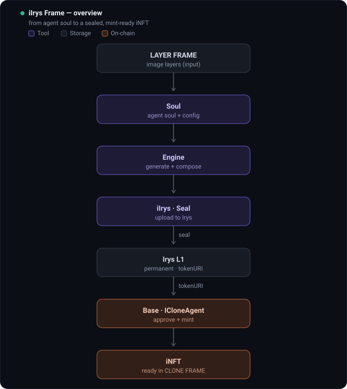
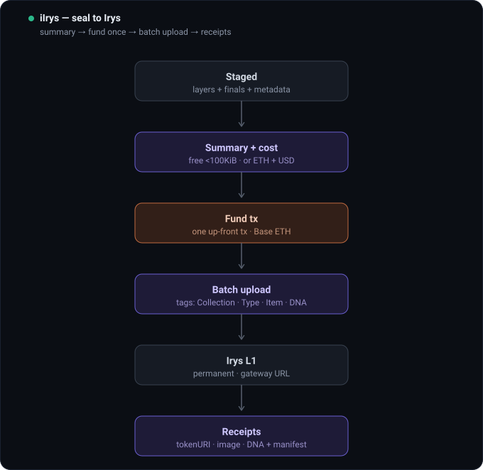
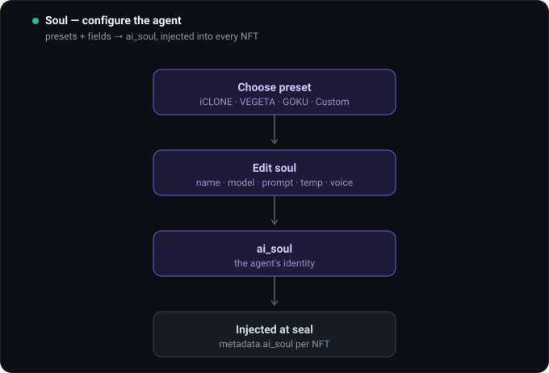
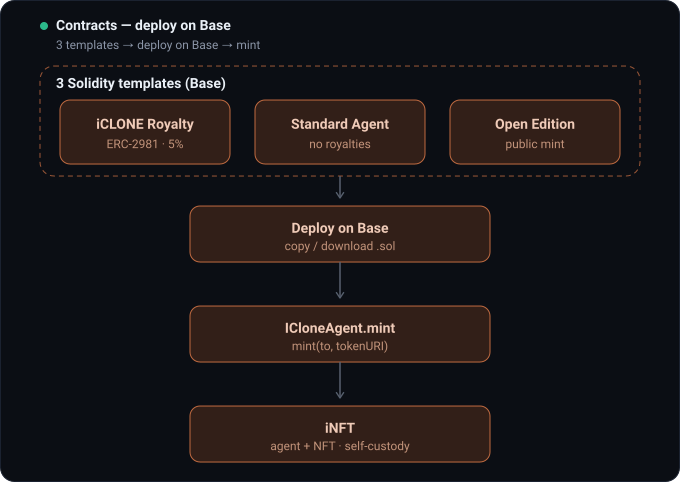
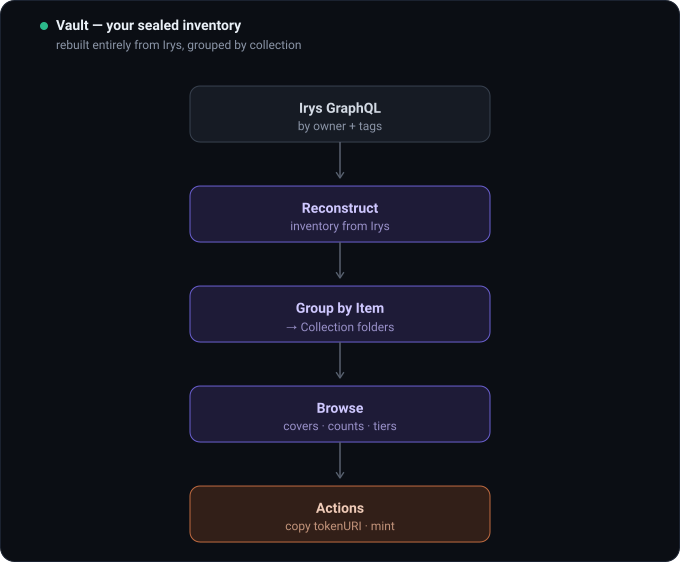

<p align="center">
  
</p>

<p align="center">
  
  
  
  
  
  
</p>

> Take art from a folder on your machine to a minted NFT collection — sealed
> forever on [Irys](https://irys.xyz), minted on Base — without writing a line of
> code or handing your files to anyone.

**iIrys Frame is a desktop app.** Download it, double-click it, and an eight-step
wizard walks the whole way: pick the format, choose how it launches, deploy the
contract, drop the art, embed the agent soul, name the collection, process, seal.
Everything runs locally in your own browser window; your wallet signs, nothing is
uploaded to a server of ours because there is no server of ours.

<p align="center"><a href="https://github.com/devclone20/iIrysframe/releases/latest"><b>⬇ Download the app</b></a></p>

```
unzip · double-click "iIrys Frame.command" · done
```

Needs macOS with Google Chrome (or Chromium/Brave/Edge/Arc). The first launch
asks for a free [Privy](https://dashboard.privy.io) App ID — paste it into the
banner in the app and it reloads ready. No install, no build step, no account
with us.

---

## What it does

| | |
|---|---|
| **3D iNFT** | Drop animated FBX/GLB/GLTF/OBJ. Each model is validated, optionally optimized, given a poster and sealed with its animation intact — OpenSea plays it. |
| **2D iNFT** | Finished images, or a **layer engine**: trait folders with rarity weights that generate the whole collection for you. |
| **Agent souls** | Every token can carry a **Neural Soul** — an agent identity in the metadata. Whoever holds the token controls it. The soul's *entire monorepo* is sealed once on Irys and referenced by every token that carries it, so an LLM can rebuild the agent from the NFT alone. |
| **Contract** | Deploy `CloneForge` (ERC-721A + ERC-2981 + ERC-6551) straight from the app on **Base** or **Robinhood Chain** — supply, price, wallet limit, royalties, OG-card gate, all constructor args. |
| **Seal** | Art + poster + metadata + drop manifest go permanently onto Irys, paid from your wallet in Base ETH. Under 100 KiB is free. |
| **Mint** | One transaction for the whole collection (drop manifest), or one per item. |
| **Vault** | Your permanent inventory, re-queried from the Irys index by tags — not a local database. |

<p align="center">
  
</p>

## The eight steps

1. **Type** — 2D or 3D · collection, single item, or layer engine.
2. **Launch** — mint on your own contract (indexed by OpenSea automatically), or prepare everything for OpenSea's own drop console.
3. **Contract** — network, royalties, supply, price, wallet limit, OG gate → deploy, or skip and deploy later.
4. **Assets** — drop your models or images. *(3D: drop a still with the same filename beside a model and it becomes that item's poster, at its own resolution.)*
5. **Souls** — one soul for the whole collection, or several mixed randomly.
6. **Names** — collection name + item naming scheme.
7. **Process** — validate, optimize, capture posters, assign rarity tiers and per-item backgrounds.
8. **Seal** — quote the cost, fund, and write everything to Irys. Then **Launch** mints it.

<p align="center">
  
</p>

### Backgrounds are per item, on purpose

One colour repeated across a whole drop reads broken on a marketplace grid. Each
item gets its own: **auto** hands every NFT its own soft pastel (deterministic —
same seed, same colours), or a model can carry its **own baked backdrop**. GLBs
that carry one are detected on drop and badged *own background ✓* — the app never
paints over art that already has a background, and it seals those files **byte for
byte untouched**, because a re-export would only degrade finished work.

### Posters

The poster is the image OpenSea shows on cards, in search and in shares. The app
captures one from its own viewer — or, if you drop an image named like the model,
uses **your** still at its full resolution (OpenSea recommends 3000×3000).

## Where things live

| folder | what |
|---|---|
| **`web/`** | The app. React + Vite + Privy + three.js. This is what the download runs. |
| **`contracts/`** | `CloneForge`, `ICloneAgent`, `FrameRoyaltySplit` — Foundry, 79 tests, `solc 0.8.28`. |
| **`terminal/`** | The same uploads from a shell with `@irys/cli`, incl. batch folders. |
| **`src/` + `public/`** | v1 headless automation API — server-signed uploads for scripted work. |
| **`scripts/`** | `make-release-zip.sh` builds the downloadable app; soul-bundle builders. |
| **`docs/`** | Architecture diagrams + research notes. |

<p align="center">
  
</p>

## Contracts

- **`CloneForge.sol`** — the drop contract. Every knob is a constructor arg, so a collection deploys in one transaction: curated per-token URIs *or* a sequential `dropBaseURI` + `mintDrop(quantity)`, `maxSupply` / `mintPrice` / `walletLimit`, optional OG-card holder gate, `contractURI()` for the collection profile, ERC-6551 token-bound account per token, optional developer-support mode.
- **`ICloneAgent.sol`** — the iNFT: ERC-721A with a per-token Irys `tokenURI` (`mint(address,string)`), ERC-2981 royalties, ERC-6551, `Ownable2Step` + `Pausable` + `ReentrancyGuard`, tokenIds from 1.
- **`FrameRoyaltySplit.sol`** — immutable two-payee ETH splitter used as the ERC-2981 receiver when a collection opts into perpetual support. Pull-only, no owner, no setters.

Both NFT contracts expose the same `mint(address,string)`, which is what the app
calls — it can point at either. CI runs `forge fmt --check`, `forge build --sizes`
and `forge test -vvv` on every push touching `contracts/`. See
[`contracts/README.md`](contracts/README.md) and [`contracts/DEPLOY.md`](contracts/DEPLOY.md).

## Why Irys

- **Permanent.** Mainnet uploads are stored forever — the right backing for art that must outlive any server.
- **Free under 100 KiB.** Every metadata JSON, most 2D sprites.
- **USD-pegged** beyond that — predictable, not gas-volatile.
- **Queryable** by tags via GraphQL — your bank is an index, not a folder. Every upload carries `App-Name`, `Item`, `Name`, `Type`, `Edition`, and `Collection`/`Tier` when set.

The split is deliberate: **Irys holds the artefacts, Base holds the claim on
them**, and one string — the `tokenURI` — connects the two.

<p align="center">
  
</p>

## Run from source

```bash
git clone --recurse-submodules https://github.com/devclone20/iIrysframe.git
cd iIrysframe/web
npm install
cp .env.example .env          # optional: VITE_PRIVY_APP_ID, VITE_MINT_CONTRACT
npm run dev                   # → http://localhost:5173
```

> Use **localhost**, not `127.0.0.1` — Privy refuses the wallet login on the IP form.

Build the downloadable app: `bash scripts/make-release-zip.sh` → `dist-release/`.

## CLONE FRAME ecosystem

iIrys Frame is a **free tool** in the CLONE FRAME / iCLONE toolkit. Inside CLONE
FRAME, the **OG PASS** — a limited on-chain access card on Base — unlocks the
**HUB** (where iNFT interaction, training sessions and automations happen), the
full toolset, and the STAGE-1 mint allowlist. Access is bound to the OG NFT
itself, so it travels with the token across wallets. **OG PASS: coming soon.**

---

## v1 — headless automation (`src/` + `public/`)

The original server-key control panel, for scripted/batch work with no wallet UI.
The signing key never touches the browser: uploads are signed server-side, bound
to localhost, with a hard funding cap.

```bash
npm install
cp .env.example .env          # then edit
npm run dev                   # → http://127.0.0.1:1717
```

| var | meaning |
|---|---|
| `PRIVATE_KEY` | EVM key that pays for/signs uploads. `0x` + 64 hex. Read-only if unset. |
| `NETWORK` | `devnet` (free testnet tokens, ~60-day retention) or `mainnet` (permanent). |
| `EVM_RPC_URL` | Optional RPC. Devnet pays in Sepolia ETH. |
| `FUND_MAX_ETH` | Hard cap per fund call (default `0.1`). |
| `VAULT_TOKEN` | Optional shared secret; if set, write routes require `x-vault-token`. |

| route | purpose |
|---|---|
| `GET /api/status` | wallet, balance, network |
| `GET /api/price?bytes=` | cost estimate + free flag |
| `POST /api/fund` | credit the node (capped) |
| `POST /api/upload` | multipart file → permanent asset (+ tags) |
| `POST /api/metadata` | ERC-721 JSON → permanent asset |
| `GET /api/assets` | local vault index + stats |
| `GET /api/assets/remote` | reconcile against the Irys GraphQL index |

## Security

- Keys live in `.env` (gitignored) and never reach the browser; the v1 server binds `127.0.0.1`.
- In the app, **your wallet signs** — no key is ever typed into iIrys Frame.
- `FUND_MAX_ETH` caps accidental over-funding; optional `VAULT_TOKEN` gates writes.
- Report vulnerabilities per [`SECURITY.md`](SECURITY.md).

MIT — see [`LICENSE`](LICENSE).
