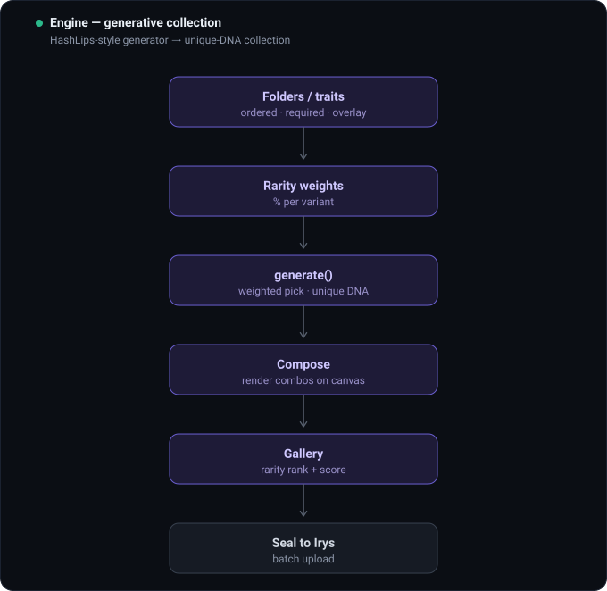

# iIrys Frame

[](LICENSE)
[](https://irys.xyz)
[](https://base.org)

> The **visible control surface** for AI-agent NFTs on a permanent layer vault — built for **CLONE FRAME** on the **Virtuals Protocol** ecosystem.

[Irys](https://irys.xyz) is an L1 *datachain*: you upload data and it lives on-chain forever, retrievable from a global gateway, queryable by tags. iIrys Frame is what Irys doesn't ship — a dark-first studio that designs an agent's **soul**, generates its **art**, **seals** both permanently on Irys, and produces the **mint-ready link (tokenURI)** — with the whole image bank organised like inventory.

The loop: **define the soul → generate the art → seal art + `ai_soul` metadata on Irys → tokenURI (mint link) → `ICloneAgent.mint(to, tokenURI)` on Base.**

**Where it fits in the CLONE FRAME pipeline:** [LAYER FRAME](https://github.com/devclone20/ilayerframe) (build the art layers) → **iIrys Frame** (this repo — soul + metadata, seal on Irys) → [CLONE FRAME](https://github.com/devclone20/clone-frame) (mint the iNFT · Plaza marketplace). On the platform, the **Genesis Engine** consumes the tokenURI produced here and runs the rest as one guided flow: mint → agent creation (Virtuals CLI) → NFT ⇄ agent link.


| | what | pays with | path |
|---|---|---|---|
| **`web/`** | **Primary.** Wallet-login app: Soul · Engine · iIrys · Vault · Swap · Contracts. | your wallet, Base ETH | [`web/`](web) |
| **`contracts/`** | The **iNFT smart contract** (`ICloneAgent`): ERC-721A + ERC-2981 (5% royalty) + per-token Irys URI + ERC-6551. | gas on Base | [`contracts/`](contracts) |
| **`terminal/`** | Same uploads from the shell (`@irys/cli`), incl. batch folders. | a private key, Base ETH | [`terminal/`](terminal) |
| **`src/` + `public/`** | v1 headless automation API + local dashboard. Signs server-side. | a server `.env` key | this folder |

---

## web/ — the app (start here)

**React + Vite + [Privy](https://privy.io)** (login with 580+ wallets *or* email/social — Privy mints an embedded wallet for users who have none), paying Irys in **Base ETH**.

```bash
cd web && npm install
cp .env.example .env        # paste your Privy App ID (free: dashboard.privy.io)
npm run dev                 # → http://127.0.0.1:5173
```

> **`VITE_PRIVY_APP_ID` is required for login.** Without it the app runs in *setup mode*: generation works, but wallet/seal/vault features are disabled until you paste an App ID and restart. Optionally set `VITE_MINT_CONTRACT` to your Base ERC-721 to enable the in-app **Mint on Base** button.

Six tabs, left to right:

- **Soul** — author the agent's `neural_soul.md` (identity + behavior), pick a preset (iCLONE · VEGETA · GOKU · Custom), tune model/temperature/voice. A live **Agent Console** lets you *chat with the agent* (powered by its own soul, bring-your-own Anthropic key kept only in your browser) and read the full `neural_soul.md` and the shared **architecture** document. The `ai_soul` object is what gets sealed into each NFT's metadata.
- **Engine** — generative art (HashLips-style): ordered trait layers with rarity weights → unique-DNA collection → composed images with rarity ranks.
- **iIrys** — seal the collection to Irys: one up-front fund tx, then batch-upload layers + final images + metadata (with `ai_soul`), returning per-item **tokenURIs** (mint links).
- **Vault** — your on-chain inventory, reconstructed from Irys and grouped per collection (layers · final · metadata) with completeness status.
- **Swap** — token swaps to top up Base ETH for funding.
- **Contracts** — three ready-to-deploy Base minting contracts (royalty / standard / open edition) with copy-paste Solidity.

Uploads pay from your wallet in Base ETH; **anything under 100 KiB is free**.

## How it works — step by step

Each tab, in order, with the detailed flow.

### Soul


### Engine



### iIrys — seal to Irys


### Vault


### Contracts


## Neural Souls — the agent identity

Every CLONE FRAME agent is born with a `neural_soul.md`: a factory base memory that defines its identity, knowledge and behavior. All souls share **one skeleton** — the human brain's four lobes mapped to four faculties (Frontal → *the Will*, Parietal → *the Senses*, Temporal → *the Memory & Voice*, Occipital → *the Vision*) — plus a shared **operating stack**: EconomyOS/ACP identity, three operating modes (Assistant · Macro · Systematic), the Hyperliquid asset universe, Fresh-Mind discipline, and **owner-gated automation** (nothing recurring self-starts; the agent waits for the owner to grant a schedule).

- [`web/public/souls/NEURAL_SOUL_ARCHITECTURE.md`](web/public/souls/NEURAL_SOUL_ARCHITECTURE.md) — the shared skeleton.
- `web/public/souls/neural_soul-{iclone,vegeta,goku}.md` — the three base souls.

Each soul leads with a different vocation: **iCLONE** (the owner's digital clone / orchestrator), **VEGETA** (remote robotics, automation & coding), **GOKU** (hacker & crypto cybersecurity guardian).

## contracts/ — the iNFT smart contract

`ICloneAgent` (Foundry): ERC-721A + ERC-2981 (configurable royalty) + Ownable2Step + Pausable + ReentrancyGuard, per-token **Irys tokenURI** set at mint, and ERC-6551 token-bound accounts. See [`contracts/README.md`](contracts/README.md) and [`contracts/DEPLOY.md`](contracts/DEPLOY.md).

```bash
cd contracts
git submodule update --init --recursive   # or: forge install
forge test
```

Deploy → paste the address into `web/.env` as `VITE_MINT_CONTRACT` to light up the in-app Mint button.

## terminal/ — Irys CLI

```bash
npm i -g @irys/cli
irys price 51200 -t base-eth              # smoke test (Base ETH)
```

See [`terminal/README.md`](terminal/README.md) and `terminal/seal-layers.sh` (seals a folder with the same tags the app reads, so CLI uploads show up in the Vault).

## v1 — headless automation (`src/` + `public/`)

The original server-key control panel (Fastify + TypeScript). The signing key never touches the browser: all uploads are signed **server-side**, bound to localhost, with a hard funding cap.

```bash
npm install
cp .env.example .env        # then edit .env (PRIVATE_KEY optional → read-only without it)
npm run dev                 # → http://127.0.0.1:1717
```

| route | purpose |
|---|---|
| `GET /api/status` | wallet, balance, network |
| `GET /api/price?bytes=` | cost estimate + free flag |
| `POST /api/fund` | credit the node (capped) |
| `POST /api/upload` | multipart file → permanent asset (+ tags) |
| `POST /api/metadata` | ERC-721 JSON → permanent asset |
| `GET /api/assets` | local vault index + stats |

## Why Irys

- **Permanent.** Mainnet uploads are stored forever — the right backing for NFT art and agent souls that must outlive any server.
- **Free under 100 KiB.** Most sprites + every metadata JSON cost nothing.
- **USD-pegged** beyond that — predictable, not gas-volatile.
- **Mutable URLs** (`/mutable/:id`) — one stable link with an updatable history. Ideal for evolving iNFT art and agent memory.
- **Queryable** by tags via GraphQL — your image bank is an index, not a folder.

## Security

This repository is sterilized: **no private keys, no `.env`, no wallet material is tracked.** The `web/` bundle holds no signing key (users sign with their own wallet via Privy); the v1 server keeps its key server-side only. See [`SECURITY.md`](SECURITY.md) for the full policy, key-handling per surface, and how to report a vulnerability.

## License

[MIT](LICENSE) © 2026 Alexandre Vieira (CLONE FRAME · devclone20).
