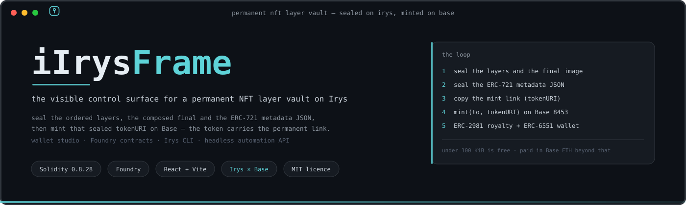
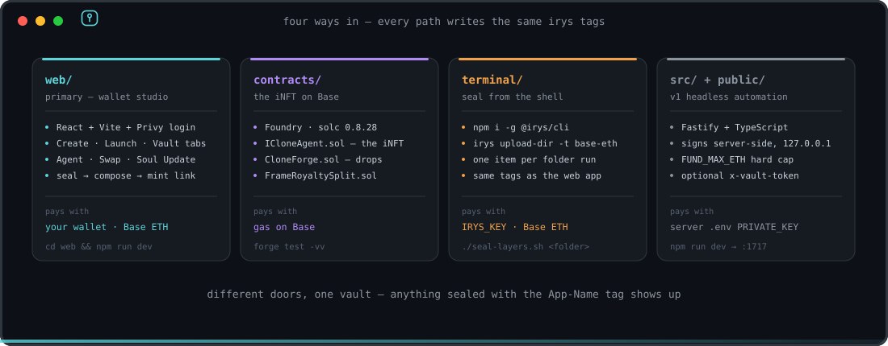
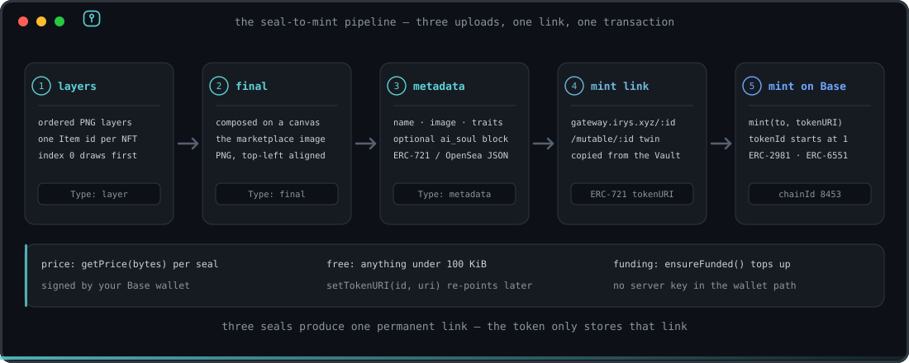
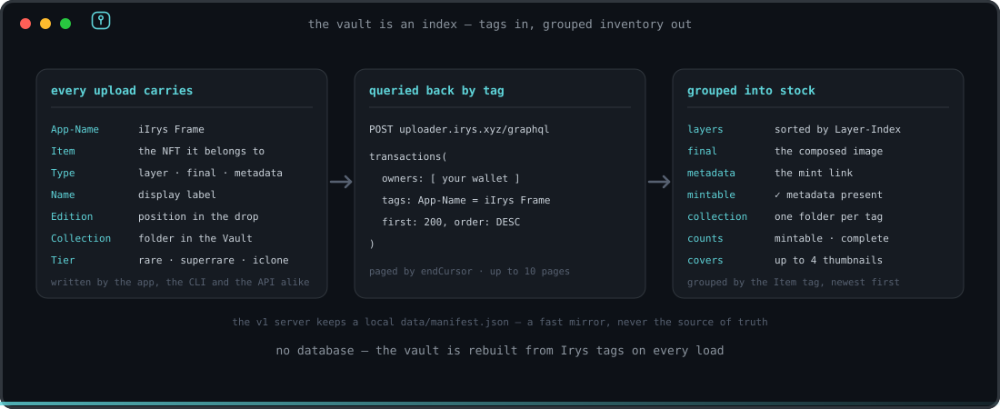
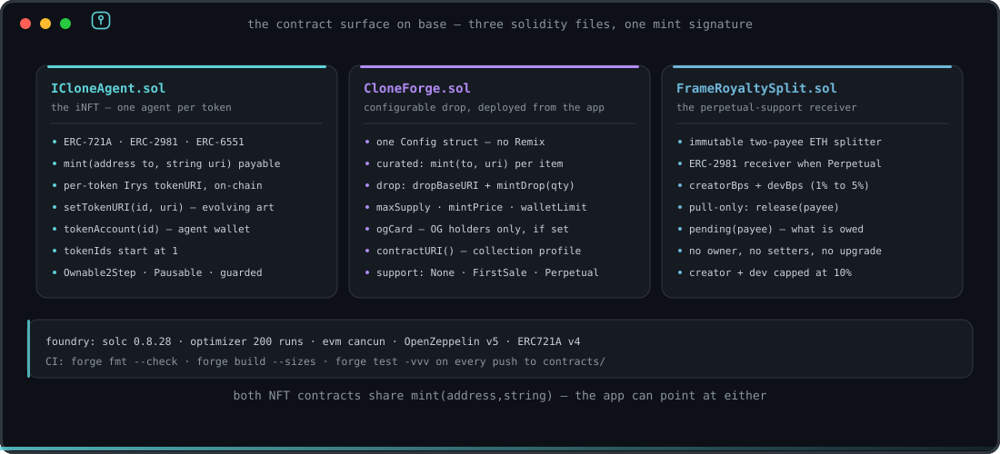
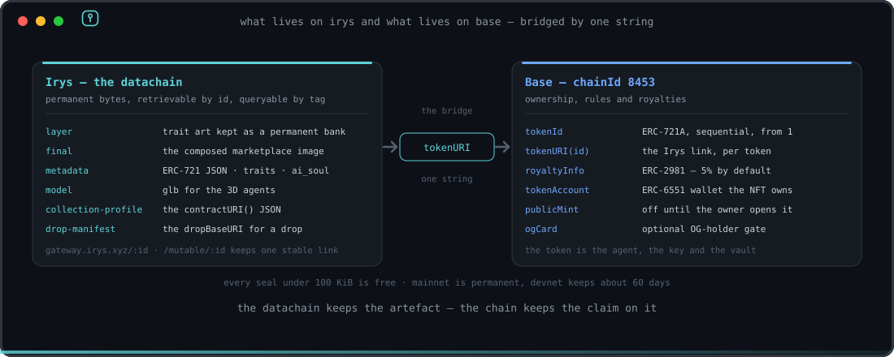

<p align="center">
  
</p>

<p align="center">
  
  
  
  
  
</p>

> The **visible control surface** for a permanent NFT layer vault on [Irys](https://irys.xyz) — built for CLONE FRAME / iCLONE.

Irys is an L1 *datachain*: you upload data and it lives on-chain forever, retrievable from a global gateway, queryable by tags. iIrys Frame is what Irys doesn't ship — a dark-first studio + stock-control vault to seal layered NFT art, compose the final image, attach metadata, and get the **mint-ready link (tokenURI)**, with everything organised like inventory.

Four ways in:

| | what | pays with | path |
|---|---|---|---|
| **`web/`** | **Primary.** Wallet-login studio + stock-control vault. Connect a wallet, seal layers, compose the final, build metadata → mint link. | **your wallet, Base ETH** | [`web/`](web) |
| **`contracts/`** | The **iNFT smart contract** (`ICloneAgent`): ERC-721A + ERC-2981 (5% royalty) + per-token Irys URI + ERC-6551. Mints from the iIrys Frame mint link. | gas on Base | [`contracts/`](contracts) |
| **`terminal/`** | Same uploads from the shell (`@irys/cli`), incl. batch folders. | a private key, Base ETH | [`terminal/`](terminal) |
| **`src/` + `public/`** | v1 headless automation API + local dashboard. Signs server-side. | a server `.env` key | this folder |

<p align="center">
  
</p>

The loop: **iIrys Frame seals art + metadata on Irys → tokenURI (mint link) → `ICloneAgent.mint(to, tokenURI)` on Base.** Deploy the contract, paste its address into `web/.env` as `VITE_MINT_CONTRACT`, and the **Mint on Base** button goes live. See [`contracts/README.md`](contracts/README.md).

## CLONE FRAME ecosystem

iIrys Frame is a **free tool** in the CLONE FRAME / iCLONE toolkit. Inside CLONE FRAME, the **OG PASS** — a limited on-chain access card (NFT) on Base — unlocks the **HUB** (the management/harness section where all iNFT interaction, training sessions and automations happen), the full CLONE FRAME toolset, and the STAGE-1 mint allowlist. Access is bound to the **OG NFT** itself — it travels with the token across wallets, so one card is one access. **OG PASS: coming soon.**

## web/ — wallet studio (start here)

Built with **React + Vite + [Privy](https://privy.io)** (login with 580+ wallets *or* email/social — Privy mints an embedded wallet for users who have none, so it works for a broad audience), paying Irys in **Base ETH**.

```bash
cd web && npm install
cp .env.example .env        # paste your Privy App ID (free: dashboard.privy.io)
npm run dev                 # → http://127.0.0.1:5173
```

> **`VITE_PRIVY_APP_ID` is required for login.** Without it the app runs in *setup mode*: the Studio composes layers, but the wallet/seal/vault features are disabled until you paste an App ID and restart. Optionally set `VITE_MINT_CONTRACT` to your Base ERC-721 to enable the in-app Mint button.

Connect a wallet on **Base** (chainId 8453) — the wallet popover shows your Base ETH balance, Irys storage credit, network, and a disconnect. **Studio**: drop ordered layers → seal → compose the final on a canvas → seal → build ERC-721 metadata → seal → copy the **mint link (tokenURI)**. **Vault**: your on-chain inventory grouped per NFT (layers · final · metadata) with completeness status, queried straight from Irys. Uploads pay from your wallet in Base ETH; **anything under 100 KiB is free**. Minting is link-first today — set `VITE_MINT_CONTRACT` (and adjust `web/src/mint.ts` if your mint signature differs) to enable the Mint button.

<p align="center">
  
</p>

Every seal is priced with `getPrice(bytes)` before it happens, and `ensureFunded()` tops the Irys node up from the connected wallet only when the balance falls short.

### The Vault is an index, not a database

Each upload carries the tags the app reads back: `App-Name`, `Item`, `Name`, `Type` (`layer` · `final` · `metadata`), `Edition`, and — when you set them — `Collection` and `Tier`. The Vault re-queries them from the Irys GraphQL index on every load, groups them by `Item`, and marks an item mintable once its metadata is sealed.

<p align="center">
  
</p>

## contracts/ — the iNFT on Base

Three Solidity files, built with Foundry (`solc 0.8.28`, optimizer 200 runs, `evm_version = cancun`), pinned to OpenZeppelin v5 and ERC721A v4 as git submodules.

<p align="center">
  
</p>

- **`ICloneAgent.sol`** — the iNFT. ERC-721A with a per-token Irys `tokenURI` (`mint(address,string)`), ERC-2981 royalties, an ERC-6551 token-bound account per token, `Ownable2Step` + `Pausable` + `ReentrancyGuard`, and tokenIds starting at 1.
- **`CloneForge.sol`** — a configurable drop contract whose every knob is a constructor arg, so a collection can be deployed straight from the app with one transaction: curated per-token URIs *or* a sequential `dropBaseURI` + `mintDrop(quantity)`, `maxSupply` / `mintPrice` / `walletLimit`, an optional OG-card holder gate, `contractURI()` for the collection profile, and an optional developer-support mode.
- **`FrameRoyaltySplit.sol`** — the immutable two-payee ETH splitter used as the ERC-2981 receiver when a collection opts into perpetual support. Pull-only, no owner, no setters.

Both NFT contracts expose the same `mint(address,string)` signature, which is exactly what `web/src/mint.ts` calls — the app can point at either. Tests and deploy steps live in [`contracts/README.md`](contracts/README.md) and [`contracts/DEPLOY.md`](contracts/DEPLOY.md); CI runs `forge fmt --check`, `forge build --sizes` and `forge test -vvv` on every push touching `contracts/`.

## terminal/ — Irys CLI

```bash
npm i -g @irys/cli
irys price 51200 -t base-eth              # smoke test (Base ETH)
```

See [`terminal/README.md`](terminal/README.md) and `terminal/seal-layers.sh` (seals a folder with the same tags the app reads, so CLI uploads show up in the Vault).

---

## v1 — headless automation (`src/` + `public/`)

The original server-key control panel. The signing key never touches the browser: all uploads are signed **server-side**, bound to localhost, with a hard funding cap. Useful for scripted/batch work where no wallet UI is wanted.

## Why Irys

- **Permanent.** Mainnet uploads are stored forever — the right backing for NFT art that must outlive any server.
- **Free under 100 KiB.** Most sprites + every metadata JSON cost nothing.
- **USD-pegged** beyond that — predictable, not gas-volatile.
- **Mutable URLs** (`/mutable/:id`) — one stable link with an updatable history. Ideal for evolving iNFT art.
- **Queryable** by tags via GraphQL — your image bank is an index, not a folder.

The split is deliberate: Irys holds the artefacts, Base holds the claim on them, and one string — the `tokenURI` — connects the two.

<p align="center">
  
</p>

## Quickstart

```bash
cd ~/Desktop/HTML/iIrysframe
npm install
cp .env.example .env        # then edit .env
npm run dev                 # → http://127.0.0.1:1717
```

Open the dashboard. With **no key** it runs read-only (browse + price). Add a `PRIVATE_KEY` to fund and seal.

### `.env`

| var | meaning |
|---|---|
| `PRIVATE_KEY` | EVM key that pays for/signs uploads. `0x` + 64 hex. Read-only if unset. |
| `NETWORK` | `devnet` (free testnet tokens, ~60-day retention) or `mainnet` (permanent). |
| `EVM_RPC_URL` | Optional RPC. Devnet pays in Sepolia ETH. |
| `FUND_MAX_ETH` | Hard cap per fund call (default `0.1`). |
| `VAULT_TOKEN` | Optional shared secret; if set, write routes require `x-vault-token`. |

> Start on **devnet** to learn the flow with free tokens. Grab some from the [Irys faucet](https://irys.xyz/faucet), fund the node from the dashboard, then seal a test asset. Switch to **mainnet** when you're ready to make it permanent.

## API

| route | purpose |
|---|---|
| `GET /api/status` | wallet, balance, network |
| `GET /api/price?bytes=` | cost estimate + free flag |
| `POST /api/fund` | credit the node (capped) |
| `POST /api/upload` | multipart file → permanent asset (+ tags) |
| `POST /api/metadata` | ERC-721 JSON → permanent asset |
| `GET /api/assets` | local vault index + stats |
| `GET /api/assets/remote` | reconcile against the Irys GraphQL index |

Every upload is tagged `App-Name: iIrys Frame` + `Network` + `Collection`/`Tier`, so the whole bank is recoverable from Irys alone — the local `data/manifest.json` is just a fast mirror.

## Stack

Fastify + TypeScript · `@irys/upload` + `@irys/upload-ethereum` · zero-build hand-crafted dashboard (vanilla, dark-first).

## Security

- Private key only in `.env` (gitignored), only server-side, never returned to the client.
- Server binds `127.0.0.1` by default.
- `FUND_MAX_ETH` caps accidental over-funding; optional `VAULT_TOKEN` gates writes.
